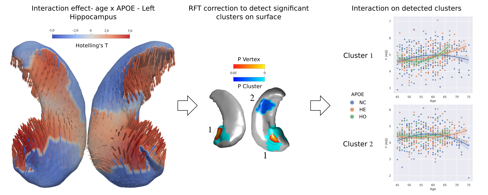

# HIPPO-SURF-ANALYSIS

## Testing interaction between apoe and age in hippocampus shape analysis
------

## What is this repository about?

The ε4 allele of the gene Apolipoprotein E (APOE) is known to be a major genetic risk factor for Alzheimer's Disease (AD) [^1]. APOE has been associated with changes in brain structure in people at advanced stages of the disease. However, it has been hypothezised that it can also affect subjects with no symptoms [^2]. Such changes could be very subtle. We studied possible subtle changes on the shape of the hippocampus, a brain structure that is early affected by the pathology. We made a nice paper on this, and when it's published this repository will be updated. The article will be called  "Non-linear interaction betwen APOE ε4 allele load and age in the hippocampal surface of cognitively healthy subjects".

## How do you do this?

First, we extracted high dimensional meshes of the hippocampus using a multi-atlas based approach [^3]. Then, we did a multivariate statistical analysis to analyze how different factors affect surface differences and interactions between them. We applied those tests on two different cohorts: a non-demented patient cohort (ALFA) and a cohort with patients at various stages of the disease (ADNI). This repository contains the code and information to do and reproduce all the experiments in the paper.

## Code description

Languages used are Python and MATLAB. Preprocessing of the data is based on ANTS [^4]. Most of the code for the experiments is based on Surfstat library [^5], "A Matlab toolbox for the statistical analysis of univariate and multivariate surface and volumetric data". 

## Description of the directories
* datasets/ Contains scripts to explore the different datasets and meshes used in this work, as well as preprocessing and preparing of the meshes to work with the analysis pipeline. Organized in different folders according to the dataset.
* experiments/ Files to run the different experiments. MATLAB code. Organized in different folders according to the dataset. Each experiment has a separate .m file.
* surfstat/ Surfstat library[^5]
* utils/ contains functions that are shared and usable in all experiments, like data preparation, visualization or testing.

## How can I obtain the data?
We only provide the code. We used two datasets for the experiments:

* ALFA dataset: https://fpmaragall.org/en/research-alzheimer/alfa-study-against-alzheimer/
* ADNI dataset: http://adni.loni.usc.edu/

If you have access to the datasets, we can provide the list of subjects identification used for each cohort upon request.

Scripts to preprocess the data can be found in the following repository. They are supposed to be run in an HPC environment: https://github.com/gsanroma/nimg-scripts

## LICENSE
GNU General Public License

## References 

[^1]: Saunders, A.M., Strittmatter, W.J., Schmechel, D., St. George-Hyslop, P.H., Pericak-Vance, M.A., Joo, S.H., Rosi, B.L., Gusella, J.F., Crapper-Mac Lachlan, D.R., Alberts, M.J., Hulette, C., Crain, B., Goldgaber, D., Roses, A.D., 1993. Association of apolipoprotein E allele ϵ4 with late-onset familial and sporadic alzheimer’s disease. Neurology 43, 1467–1472. https://doi.org/10.1212/wnl.43.8.1467

[^2]:Fouquet, M., Besson, F.L., Gonneaud, J., La Joie, R., Chételat, G., 2014. Imaging Brain Effects of APOE4 in Cognitively Normal Individuals Across the Lifespan. Neuropsychol. Rev. 24, 290–299. https://doi.org/10.1007/s11065-014-9263-8

[^3]: Wang, H., Yushkevich, P.A., 2013. Multi-atlas segmentation with joint label fusion and corrective learning—an open source implementation. Front. Neuroinform. 7, 27. https://doi.org/10.3389/fninf.2013.00027

[^4]: http://stnava.github.io/ANTs/

[^5]: http://www.math.mcgill.ca/keith/surfstat/
